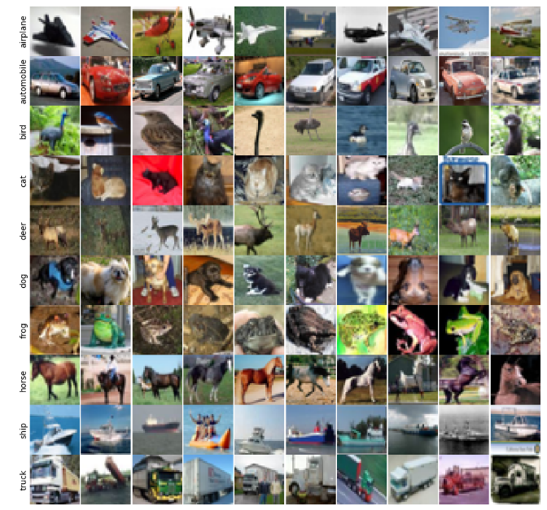

# PaddlePaddle 学习笔记： 图像分类

> 该文章主要记录我学习 PaddlePaddle 时的笔记，以备以后查阅方便。

> 文章更新于 2019-01-12

## 图像分类

图像分类是计算机视觉的一个主要任务之一，是指根据一定的分类规则将图像自动分到一组预定义类别中的过程。目标分类是目标检测、目标追踪、图像分割等任务的基础。


随着深度卷积神经网络的出现，目前基本上都是使用卷积神经网络来做图像分类。现在比较经典的卷积神经分类网络包括以下：

* **LeNet** <sup>[1]</sup>
* **AlexNet** <sup>[2]</sup>
* **VGGNet** <sup>[3]</sup>
* **GoogLeNet** <sup>[4]</sup> 
* **ResNet** <sup>[5]</sup>
* ...更多分类网络可以阅读 [object_classification](https://github.com/busyboxs/Object-detection/blob/master/object_classification.md)

## 数据集分析

本文使用的分类数据集是 [cifar10](http://www.cs.toronto.edu/~kriz/cifar.html)，cifar10 提供三种类型的数据，我们这里使用的是 CIFAR-10 python version 数据,你可以在这里[下载](http://www.cs.toronto.edu/~kriz/cifar-10-python.tar.gz)，或者直接在官网下载。

PaddlePaddle 也提供了下载脚本，当你运行`fluid.datasets.cifar.train10()`时，脚本会自动下载数据集，下载的存放位置为user用户文件夹下的`'~/.cache/paddle/dataset'`目录。

### 数据集介绍

数据集下载后会得到一个名为 `cifar-10-python.tar.gz` 的压缩文件。可以通过以下指令进行解压缩, 指令详解可以[参考这里](http://man.linuxde.net/tar)。

```python
tar -xvzf data/cifar-10-python.tar.gz
```

压缩文件包含文件 **data_batch_1**，**data_batch_2**，**data_batch_3**，**data_batch_4**, **data_batch_5**，**test_batch**以及**batches.meta**。前5个是训练数据集，test_batch 是测试数据集。这些文件都是使用 json 来封装的，因此可以通过下面代码来进行解析。

```python
# for python2
def unpickle(file):
    import cPickle
    with open(file, 'rb') as fo:
        dict = cPickle.load(fo)
    return dict

# for python3
def unpickle(file):
    import pickle
    with open(file, 'rb') as fo:
        dict = pickle.load(fo, encoding='bytes')
```

经过解析之后，会得到一个字典，除了 batches.meta 外，其他字典的键为`{'data', 'labels', 'batch_label', 'filenames'}`，每个键对应的值信息如下：

* **data**: 一个10000x3072 uint8s 的 numpy 数组。阵列的每一行都存储一个32x32的彩色图像。3072 列分别为 1024 列红色通道，1024 列绿色通道，1024 列蓝色通道，图像以行主顺序存储，因此数组的前 32 个条目是图像第一行的红色通道值。
* **labels**: 0-9 范围内的 10000 个数字列表。索引 i 处的数字表示阵列数据中第 i 个图像的标签
* **batch_label**: 每个文件块的信息，例如：data_batch_1 的 batch_label为 “training batch 1 of 5”
* **file_names**: 每张图像的文件名

batches.meta 文件主要包含 cifar10 的信息，具体内容为：

```
{'label_names': ['airplane',
                 'automobile',
                 'bird',
                 'cat',
                 'deer',
                 'dog',
                 'frog',
                 'horse',
                 'ship',
                 'truck'],
 'num_cases_per_batch': 10000,
 'num_vis': 3072}
```

图像总共有10类，每一个类别对应于一个数字，具体的对应关系如下表所示：

|类别索引|0|1|2|3|4|5|6|7|8|9|
|:----:|:----:|:----:|:----:|:----:|:----:|:----:|:----:|:----:|:----:|:----:|
|Class Name|airplane|automobile|bird|cat|deer|dog|frog|horse|ship|truck|
|类别名称|飞机|汽车|鸟|猫|鹿|狗|青蛙|马|船|卡车|

对部分图像进行展示



## 使用 PaddlePaddle做图像分类

本文参照PaddlePaddle官方的教程进行实验，使用的模型为resnet。

### 导入依赖库

```python
import six
import numpy as np
import cPickle
import paddle
import paddle.fluid as fluid
import os
import sys
```

### 构建 resnet 模型 <sup>[6]</sup>

残差模块


基于ImageNet的ResNet模型


`resnet_cifar10`中的一些基本函数

* `conv_bn_layer` : 带 BN 的卷积层。
* `shortcut` : 残差模块的"直连"路径，"直连"实际分两种形式：残差模块输入和输出特征通道数不等时，采用1x1卷积的升维操作；残差模块输入和输出通道相等时，采用直连操作。
* `basicblock` : 一个基础残差模块，由两组3x3卷积组成的路径和一条"直连"路径组成。
* `bottleneck` : 一个瓶颈残差模块，由上下1x1卷积和中间3x3卷积组成的路径和一条"直连"路径组成。
* `layer_warp` : 一组残差模块，由若干个残差模块堆积而成。每组中第一个残差模块滑动窗口大小与其他可以不同，以用来减少特征图在垂直和水平方向的大小。

```python
def conv_bn_layer(input,  ch_out, filter_size, stride, padding, act='relu', bias_attr=False):
    tmp = fluid.layers.conv2d(
        input=input,
        filter_size=filter_size,
        num_filters=ch_out,
        stride=stride,
        padding=padding,
        act=None,
        bias_attr=bias_attr)
    return fluid.layers.batch_norm(input=tmp, act=act)


def shortcut(input, ch_in, ch_out, stride):
    if ch_in != ch_out:
        return conv_bn_layer(input, ch_out, 1, stride, 0, None)
    else:
        return input


def basicblock(input, ch_in, ch_out, stride):
    tmp = conv_bn_layer(input, ch_out, 3, stride, 1)
    tmp = conv_bn_layer(tmp, ch_out, 3, 1, 1, act=None, bias_attr=True)
    short = shortcut(input, ch_in, ch_out, stride)
    return fluid.layers.elementwise_add(x=tmp, y=short, act='relu')


def layer_warp(block_func, input, ch_in, ch_out, count, stride):
    tmp = block_func(input, ch_in, ch_out, stride)
    for i in range(1, count):
        tmp = block_func(tmp, ch_out, ch_out, 1)
    return tmp


def resnet_cifar10(ipt, depth=32):
    # depth should be one of 20, 32, 44, 56, 110, 1202
    assert (depth - 2) % 6 == 0
    n = (depth - 2) // 6
    nStages = {16, 64, 128}
    conv1 = conv_bn_layer(ipt, ch_out=16, filter_size=3, stride=1, padding=1)
    res1 = layer_warp(basicblock, conv1, 16, 16, n, 1)
    res2 = layer_warp(basicblock, res1, 16, 32, n, 2)
    res3 = layer_warp(basicblock, res2, 32, 64, n, 2)
    pool = fluid.layers.pool2d(
        input=res3, pool_size=8, pool_type='avg', pool_stride=1)
    predict = fluid.layers.fc(input=pool, size=10, act='softmax')
```

`resnet_cifar10` 的连接结构主要有以下几个过程:

1. 底层输入连接一层 `conv_bn_layer`，即带BN的卷积层。
2. 然后连接3组残差模块即下面配置3组 `layer_warp` ，每组采用残差模块组成。
3. 最后对网络做均值池化并返回该层。

### 构建 Reader函数

本文在这里自己构建reader函数，主要从解压后的文件得到数据生成器。你也可以使用官方的 reader，直接使用 `paddle.dataset.cifar.train10()` 和 `paddle.dataset.cifar.test10()`

```python
def reader_creater(filename):
    if not isinstance(filename, str) and not isinstance(filename, list):
        print('Type error: filename must be list or str!')
        return 
    if isinstance(filename, str):
        filename = [filename]
    
    def read_batch(batch):
        data = batch[six.b('data')]
        labels = batch[six.b('labels')]
        for img, label in six.moves.zip(data, labels):
            yield (img/255.0).astype(np.float32), int(label)
            
    def reader():
        for file in filename:
            with open(file, 'rb') as f:
                batch = cPickle.load(f)
                
            for item in read_batch(batch):
                yield item
                
    return reader
```

因为解压缩数据集文件后会得到5个训练文件和1个测试文件，因此reader_creater 需要传入一个字符串或者列表，代表文件名或者文件名列表。

### 训练模型配置

首先定义一些配置参数并构建 train_reader 和 test_reader。

```python
BATCH_SIZE = 32
use_cuda = False
place = fluid.core.CUDAPlace(0) if use_cuda else fluid.core.CPUPlace()

train_list = [os.path.join('data/cifar10', p) for p in os.listdir('data/cifar10') if 'data' in p]
test_list = ['data/cifar10/test_batch']
train_reader = paddle.batch(
    paddle.reader.shuffle(reader_creater(train_list), buf_size=128*100), 
    batch_size=BATCH_SIZE)
test_reader = paddle.batch(reader_creater(test_list), batch_size=BATCH_SIZE)
```

然后构建网络并执行初始化

```python
main_program = fluid.default_main_program()
startup_program = fluid.default_startup_program()

image = fluid.layers.data(name='image', shape=[3, 32, 32], dtype='float32')
label = fluid.layers.data(name='label', shape=[1], dtype='int64')
feeder = fluid.DataFeeder(feed_list=[image, label], place=place)
predict = resnet_cifar10(image, depth=32)

cost = fluid.layers.cross_entropy(input=predict, label=label)
mean_cost = fluid.layers.mean(cost)
accracy = fluid.layers.accuracy(input=predict, label=label)

test_program = main_program.clone(for_test=True)

optimizer = fluid.optimizer.Adam(learning_rate=0.001)
optimizer.minimize(mean_cost)

exe = fluid.Executor(place)
exe.run(startup_program)
```

接着开始训练，并在每个训练epoch之后进行测试并保存模型。

```python
save_path = "model/image_classification_resnet.inference.model"
EPOCHS = 1
step = 0

for pass_id in range(EPOCHS):
    for step_id, data_train in enumerate(train_reader()):
        out = exe.run(main_program, feed=feeder.feed(data_train), fetch_list=[mean_cost, accracy])
        if step_id % 100 == 0:
            print('\npass: {}, Batch： {}, loss: {}, accracy: {}'.format(pass_id, step_id, out[0], out[1]))
        else:
            sys.stdout.write('=')
            sys.stdout.flush()
            
        step += 1
    
    acc_set = []
    mean_loss_set = []    
    for test_id, data_test in enumerate(test_reader()):
        mean_loss_np, accuracy_np = exe.run(test_program, feed=feeder.feed(data_test), fetch_list=[mean_cost, accracy])
        mean_loss_set.append(float(mean_loss_np))
        acc_set.append(float(accuracy_np))
    mean_cost_val = np.array(mean_loss_set).mean()
    acc_val = np.array(acc_set).mean()
    print('\nTest - Epoch: {}, loss: {}, accuracy: {}'.format(pass_id, mean_cost_val, acc_val))
    
    if save_path is not None:
        fluid.io.save_inference_model(save_path, feeded_var_names=['image'], target_vars=[predict], executor=exe)
```

### 推断模型配置

在训练结束之后，会在指定的存储地址保存模型，用于推断测试。

本文提供两种推断模式，一种是直接使用test_reader进行推断，另一种是使用一张图像进行推断.

#### 使用test_reader进行推断

```python
save_path = "model/image_classification_resnet.inference.model"
use_cuda = False

place = fluid.core.CUDAPlace(0) if use_cuda else fluid.core.CPUPlace()
exe = fluid.Executor(place)

test_reader = paddle.batch(reader_creater(['data/cifar10/test_batch']), batch_size=16)

inference_scope = fluid.core.Scope()

with fluid.scope_guard(inference_scope):
    [inference_program, feed_target_names, fetch_targets] = fluid.io.load_inference_model(save_path, exe)
    test_d = test_reader().next()
    fig = plt.figure(figsize=(12, 12))
    for i, (data, label) in enumerate(test_d):
        plt.subplot(4, 4, i+1)
        img = np.array(data).reshape(3, 32, 32).transpose(1, 2, 0)
        img_pre = np.expand_dims(np.array(data).reshape(3, 32, 32), axis=0)
        results = exe.run(
            inference_program, 
            feed={feed_target_names[0]: img_pre}, 
            fetch_list=fetch_targets)
        pred = np.argmax(results)
        plt.imshow(img)
        plt.title('Predict: {}\n Label: {}'.format(class_name[pred], class_name[label]))
        plt.axis('off')
    plt.show()
```

#### 使用图像进行推断

```python
from PIL import Image

def load_image(infer_file):
    im = Image.open(infer_file)
    im = im.resize((32, 32), Image.ANTIALIAS)

    im = np.array(im).astype(np.float32)

    im = im.transpose((2, 0, 1))  # CHW
    im = im / 255.0

    # Add one dimension to mimic the list format.
    im = np.expand_dims(im, axis=0)
    return im

save_path = "model/image_classification_resnet.inference.model"
use_cuda = False

place = fluid.core.CUDAPlace(0) if use_cuda else fluid.core.CPUPlace()
exe = fluid.Executor(place)

img = load_image('/home/aistudio/data/data3405/dog.png')
plt.imshow(img[0].transpose(1, 2, 0))
plt.show()

inference_scope = fluid.core.Scope()

with fluid.scope_guard(inference_scope):
    [inference_program, feed_target_names, fetch_targets] = fluid.io.load_inference_model(save_path, exe)
    results = exe.run(
            inference_program,
            feed={feed_target_names[0]: img},
            fetch_list=fetch_targets)
    print("Infer results: {}".format(class_name[np.argmax(results[0])]))
```

代码的具体输出结果可以点击[这里](classification_cifar10.ipynb)查看。

## 参考文献

[1] [Gradient-Based Learning Applied to Document Recognition](http://yann.lecun.com/exdb/publis/pdf/lecun-01a.pdf)

[2] [ImageNet Classification with Deep Convolutional Neural](https://papers.nips.cc/paper/4824-imagenet-classification-with-deep-convolutional-neural-networks.pdf) 

[3] [Very Deep Convolutional Networks for Large-Scale Image](https://arxiv.org/abs/1409.1556)

[4] [Going Deeper With Convolutions](http://arxiv.org/abs/1409.4842)

[5] [Deep Residual Learning for Image Recognition](https://arxiv.org/abs/1512.03385)

[6] [图像分类](http://paddlepaddle.org/documentation/docs/zh/1.2/beginners_guide/basics/image_classification/index.html)